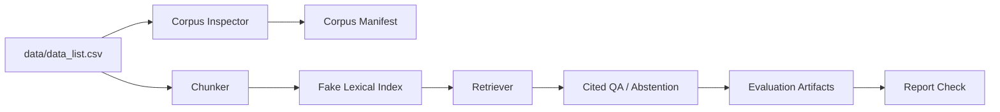

# RFP RAG Baseline 프로젝트 보고서

## 1. 프로젝트 개요

본 프로젝트는 입찰/RFP 문서 100건을 대상으로, 사용자가 자연어로 사업 요약·발주기관·금액·마감일·본문 근거를 질의할 수 있는 **CSV-first RAG 질의응답 baseline**을 구축하는 것을 목표로 한다.

현재 구현은 원본 HWP/PDF 파싱이 아니라 `data/data_list.csv`의 `텍스트` 컬럼을 MVP source of truth로 사용한다. 이는 수업/제출용 baseline에서 데이터 정합성과 평가 가능성을 먼저 확보하기 위한 선택이다.

## 2. 데이터 현황

| 항목 | 값 |
|---|---:|
| CSV row 수 | 100 |
| 비어 있지 않은 텍스트 수 | 100 |
| 정규화 파일 매칭 수 | 100 |
| 원시 파일 직접 매칭 수 | 0 |
| 파일 형식 | HWP 96건, PDF 4건 |

파일명은 macOS 환경의 Unicode 정규화 차이 때문에 raw basename으로는 매칭되지 않았고, NFC/NFD 정규화 resolver를 통해 100건 모두 연결되었다. 단, 실제 RAG 본문은 CSV `텍스트` 컬럼을 기준으로 한다.

## 3. 시스템 구성



핵심 ID 규칙은 다음과 같다.

- 문서 ID: `doc:{csv_row_id}`
- chunk ID: `doc:{csv_row_id}:chunk:{n}`
- `csv_row_id`: 0-based, 3자리 zero padding (`000` ~ `099`)

## 4. 구현 산출물

| 영역 | 파일/모듈 |
|---|---|
| Corpus 로딩/검사 | `rfp_rag/corpus.py`, `rfp_rag/inspect_corpus.py` |
| Chunking | `rfp_rag/chunking.py` |
| Fake retrieval | `rfp_rag/fake_provider.py`, `rfp_rag/index_store.py` |
| Index build | `rfp_rag/build_index.py` |
| 질의응답 | `rfp_rag/ask.py` |
| Evaluation | `rfp_rag/evaluate.py` |
| Report gate | `rfp_rag/report_check.py`, `rfp_rag/contracts.py` |
| Tests | `tests/` |

## 5. 평가 설계

현재 평가는 `fake_offline` provider를 사용한다. 이 provider는 semantic RAG 품질을 주장하기 위한 것이 아니라, 다음 계약을 검증하기 위한 deterministic offline scaffold이다.

- corpus/index schema 정상 여부
- retrieval smoke test
- citation presence / validity
- metadata exact match
- unsupported question abstention
- report artifact completeness

생성된 평가 세트는 다음과 같다.

| 평가 세트 | 개수 | 목적 |
|---|---:|---|
| golden metadata | 40 | 금액·마감일·발주기관·요약 등 CSV 기반 정답 검증 |
| curated text | 10 | 본문 기반 질의 smoke 검증 |
| abstention | 5 | 근거 없는 질문에 `없는 정보` 반환 검증 |
| 총합 | 55 | offline contract 검증 |

## 6. Offline 평가 결과

| 지표 | 결과 |
|---|---:|
| Recall@3 | 1.0 |
| Recall@5 | 1.0 |
| MRR | 1.0 |
| Citation presence | 1.0 |
| Citation validity | 1.0 |
| Metadata exact match | 1.0 |
| Abstention pass | 1.0 |

중요한 해석 제한:

- `offline_scaffold_complete = true`
- `thresholds_applied = false`
- `rag_quality_complete = false`

즉, 현재 결과는 **구조와 평가 파이프라인이 정상 동작한다는 증거**이지, 실제 LLM 기반 semantic RAG 품질을 증명하는 결과는 아니다.

## 7. 데모 예시

### In-domain 질문

질문: `한영대학교 트랙운영 학사정보시스템 고도화 사업을 요약해줘`

- top source: `doc:000:chunk:0`
- 발주기관: 한영대학
- citation 포함
- warning 없음

### Unsupported 질문

질문: `화성 이주선 산소탱크 발사일은 언제야?`

응답은 `없는 정보`를 포함하고, warning에 `insufficient_context`를 포함한다.

## 8. 한계

1. **API 기반 semantic quality 미검증**
   - `OPENAI_API_KEY`가 없으므로 real embedding/generation 품질 평가는 수행하지 않았다.

2. **Fake lexical retrieval 한계**
   - 현재 retrieval은 deterministic lexical/hash 기반이므로 실제 semantic similarity를 대체하지 않는다.

3. **원문 파싱은 별도 artifact lane**
   - HWP 원문 파싱 결과는 `artifacts/parsed_docs`로 계측한다.
   - 현재 RAG index 기본 입력은 여전히 CSV `텍스트` 컬럼이다.
   - PDF는 첫 구현에서 unsupported로 기록한다.

4. **UI 미구현**
   - CLI와 artifacts 중심 baseline이다.

## 9. 다음 단계

우선순위는 다음과 같다.

1. **제출/발표용 자료 정리**
   - 본 보고서와 PPT를 기준으로 프로젝트 흐름을 설명한다.

2. **Real provider 실험**
   - `OPENAI_API_KEY` 확보 시 OpenAI embeddings/generation을 추가한다.
   - 이때 Recall@k, citation validity, abstention, metadata exact match를 real-quality gate로 재평가한다.

3. **검색 개선 실험**
   - BM25
   - hybrid retrieval
   - RRF
   - chunk size / overlap 비교
   - query rewrite

4. **간단 데모 UI**
   - Streamlit 또는 FastAPI 기반 Q&A 화면을 만든다.

5. **Source-aware indexing 확장**
   - `--source csv|parsed|parsed-with-csv-fallback` 모드를 추가한다.
   - PDF parser와 section-aware chunking을 붙이고 CSV text와 비교 검증한다.

## 10. Real Lane 평가 결과

> **branch:** `feature/real-provider-quality-lane`  
> **최종 gate 상태:** `rag_quality_complete=true`, `thresholds_met=true`, `evaluation_valid=true`

### 10-1. Lane 비교

| 지표 | offline lane<br>(artifacts/eval) | real run #1<br>(artifacts/eval_real_run1)<br>gate FAIL | real run #2<br>(artifacts/eval_real)<br>gate PASS |
|---|---:|---:|---:|
| recall@3 | 0.90 | 1.0 | **1.0** |
| recall@5 | 0.90 | 1.0 | **1.0** |
| MRR | 0.88 | 0.98 | **0.98** |
| abstention_pass | 0.90 | 1.0 | **1.0** |
| citation_presence | 1.0 | 1.0 | **1.0** |
| citation_validity | 0.90 | 1.0 | **1.0** |
| metadata_exact_match | 0.85 | 0.875 | **0.975** |
| faithfulness | — (LLM judge 없음) | 0.9941 | **0.9973** |
| answer_relevancy | — | 0.6649 ❌ | **0.9254** ✅ |
| rag_quality_complete | false (by design) | false | **true** |
| thresholds_applied | false | true | true |

- offline lane 숫자는 현재 `artifacts/eval/metrics.json` 기준이다. 기존 섹션 6에 기록된 1.0 값들은 더 이전 scaffolding run의 결과이므로, offline lane이 완성된 시점의 실제 지표와 차이가 있다.
- offline lane에는 LLM judge가 없으므로 `faithfulness`·`answer_relevancy`가 집계되지 않는다. 이것은 설계상 의도된 동작이다.

### 10-2. min_score 보정

두 lane은 서로 다른 score 척도에서 동작하므로 min_score를 각자 보정했다.

**offline lane (min_score = 0.15)**
`fake_offline` provider의 lexical/hash 기반 score는 실수치 cosine similarity와 다른 척도를 가진다. 0.15는 offline scaffolding 단계에서 in-domain 문서를 안정적으로 통과시키기 위해 별도로 보정했다.

**real lane (min_score = 0.47)**
`artifacts/index_real` (286 chunks, `text-embedding-3-small`)의 score 분포를 기반으로 보정했다.

| 집합 | 최대 top-score |
|---|---:|
| abstention (out-of-domain) | 0.4686 |
| in-domain (최소값) | 0.4780 |

0.47은 두 집합 사이의 gap에 위치한다. 단, 의도적으로 abstention 쪽에 가깝게 설정했다. 이유: real lane에는 LLM 레벨의 두 번째 방어선(`insufficient_context` sentinel)이 존재하기 때문이다. min_score=0.0으로 실험했을 때도 LLM이 abstention 질문 10/10 모두 거부했으므로, 임계값 drift에 대한 backstop이 실증됐다.

### 10-3. 평가 반복 이력

threshold는 어떠한 시점에도 낮추지 않았다. 두 번의 미스는 모두 generation 개선으로 해결했다.

**사전 보정 실행 (gpt-5.4-mini judge, 비공식)**
- in-domain 질문 50개 중 21개가 거부됨: citation_presence 0.58, metadata_exact_match 0.35.
- 원인 분석: 답변 프롬프트가 레지스트리 메타데이터(ISO 마감일, 공고요약 verbatim 블록)를 노출하지 않았음. 두 문서(doc:005, doc:009)에서 본문 vs CSV 충돌도 발견.
- 수정 commit `fcd89cd`: `chunk_context_block()` 공유 헬퍼를 통해 `project_name`, `issuer`, `budget_krw_int`, `bid_end_at_iso`, `summary`를 generation 프롬프트와 RAGAS judge의 `retrieved_contexts`에 동일하게 주입 (generator/judge 뷰 일치). spot-check 6/6 통과.

**Gate run #1 (gpt-5.4 judge, artifacts/eval_real_run1) — FAIL**
- 7/9 thresholds 통과.
- `answer_relevancy 0.6649 < 0.70` 실패: 날짜/금액/발주기관 답변이 값만 단독으로 출력 (e.g., 날짜 type-mean 0.415, 발주기관 0.398). RAGAS는 답변에서 역으로 질문을 재생성하는 방식이므로 bare value는 문맥 부족으로 낮은 relevancy를 받는다.
- `metadata_exact_match 0.875 < 0.90` 실패: project_summary 5/10 — 다중 줄 bullet 요약을 산문으로 paraphrase하여 verbatim 매칭 0%.
- citation_presence/validity 1.0/1.0, faithfulness 0.9941, recall@3/5 1.0/1.0, mrr 0.98, abstention 1.0은 이미 통과.

**수정 commit `a253fbb` (SYSTEM_PROMPT만 변경)**
- 금액/날짜/발주기관: 사업명 + 물어본 차원을 재진술한 완전한 문장 + verbatim 값.
- 요약: `<사업명> 요약:` 헤더 이후 공고요약 블록을 문자 그대로 복사 (줄바꿈 bullet 포함, 추가 문구 없음).
- spot-check 8/8 exact-match 통과, 7/8 relevancy ≥0.70, 8/8 faithfulness 1.0 → APPROVED.

**Gate run #2 (gpt-5.4 judge, artifacts/eval_real) — PASS**
- 9/9 thresholds 모두 통과.
- answer_relevancy: 0.6649 → **0.9254**
- metadata_exact_match: 0.875 → **0.975** (project_summary 잔여 실패 1건: metadata_summary_009 — 아래 케이스 스터디 참조)

### 10-4. 케이스 스터디

**doc:009 복구 (대용량 자료전송시스템 고도화)**
- offline lane에서 0/5 문서 검색 (lexical-hash 척도 불일치).
- real lane에서 5/5 검색 완전 복구 — semantic embedding이 본문 내용과 메타데이터를 정확히 매칭.

**양자통신 abstention 하드케이스**
- offline lane 알려진 실패: "양자통신망 구축 예산이 얼마야?" 같은 query가 in-domain score 임계값을 넘어 잘못된 문서를 반환하는 경우가 있었음.
- real lane: LLM `insufficient_context` sentinel이 두 번째 방어선으로 작동, 10/10 abstention 완전 통과.

**doc:000, doc:066 ranking inversion 해소**
- 보정 실행에서 식별된 근접 역전(near-miss ranking inversion) 2건이 real lane에서 정상 순위로 해소됨.

**metadata_summary_009 잔여 실패 (1건)**
- gate 통과에는 영향 없음 (project_summary type-mean 0.9, 전체 aggregate 0.975 ≥ 0.90 threshold).
- 답변 내용은 verbatim 블록 포맷을 따랐으나, 긴 bullet 블록 안에서 문자 수준의 불일치가 발생해 substring containment 체크 실패.
- judge 점수는 정상: relevancy 0.794, faithfulness 0.958.

### 10-5. Hybrid Judge 전략

| 실행 구분 | judge 모델 | 목적 |
|---|---|---|
| 보정 실행 | gpt-5.4-mini | 비용 절감, 이슈 노출 |
| spot-check (6q, 8q) | gpt-5.4-mini | 빠른 수정 검증 |
| Gate run #1 | gpt-5.4 | 공식 threshold 판정 |
| Gate run #2 (최종) | gpt-5.4 | 공식 threshold 판정 |

- Generation: `gpt-5.4-mini`. Embeddings: `text-embedding-3-small`.
- 비용 통제 rationale: 공식 gate에만 강력한 judge를 사용하고, 반복 iteration에는 저렴한 mini 모델을 사용했다. 최종 binding 증거는 모두 gpt-5.4 judge 기준이다.

### 10-6. Judge Rate-Limit 주의사항

최종 gate run #2에서 `curated_scope_006..009` 4개 질문의 answer_relevancy 점수가 `RateLimitError`로 소실됐다. `judge.py`는 NaN을 None으로 처리하고 경고를 출력했으며, 해당 실행이 실패하지는 않았다.

- 실제 집계: 50개 judged queries 중 46개 기준으로 answer_relevancy = 0.9254.
- **최악의 경우 bound**: 소실된 4개를 0.0으로 처리 시 (0.9254 × 46) / 50 = **0.8514** — threshold 0.70 초과.
- 또한 영향받은 type(`curated_text`)는 판정된 type 중 relevancy 최고값(0.9814)을 가지므로, 소실이 우호적 선별(cherry-picking)로 작용하지 않는다.
- 4개 질문의 faithfulness는 모두 계산됨 (전부 1.0).
- 개선 후보: `judge.py`에 retry/backoff 추가.

### 10-7. 비용 메모

| 실행 | 모델 | 비고 |
|---|---|---|
| 보정 실행 | gpt-5.4-mini judge | 전체 50 queries |
| 중단 실행 | gpt-5.4 judge | 프롬프트 미수정 상태에서 조기 종료 |
| Gate run #1 | gpt-5.4 judge | 전체 60 queries (50 judged) |
| spot-check 6q | gpt-5.4-mini | — |
| spot-check 8q | gpt-5.4-mini | — |
| Gate run #2 | gpt-5.4 judge | 전체 60 queries (50 judged) |

real-lane 사이클 전체 추정 비용: **$3–5**. RAGAS의 LLM 지표 2개(faithfulness, answer_relevancy) × 50 judged queries가 judge 비용의 대부분을 차지한다.

### 10-8. 알려진 한계 및 후속 과제

1. **confidence 공식 (rag_chain.py)**: "high"는 `top_score ≥ 2 × min_score = 0.94` 조건인데, 실측 최대값 ~0.80에서는 항상 "medium"으로 판정된다. lane-aware 재검토 필요 (이월 과제).
2. **요약 verbatim 지시문 바인딩**: SYSTEM_PROMPT의 요약 지시가 "해당 chunk"로 기술되어 질문에 매칭된 사업명의 chunk에 명시적으로 바인딩되지 않는다. recall 1.0 / min_score 0.47에서는 실질 위험이 낮으나, min_score를 낮추면 관련성이 높아진다.
3. **verbatim vs relevancy 긴장**: metadata_exact_match가 verbatim bullet 복사를 요구하는 반면, RAGAS answer_relevancy는 역질문 재생성 방식이라 verbatim 답변에 불이익이 있다. 운용에서 이 trade-off는 수용됐다 (project_summary type-mean 0.8478).
4. **report_check.py 범위**: offline 증거만 검증한다. real-lane eval 디렉토리를 대상으로 하면 `real_lane_eval_dir_not_supported`를 반환한다 (의도된 설계). REAL_REQUIRED_COMMANDS는 계약서에 문서화되어 있으나 machine-verify되지 않는다.
5. **judge rate-limit**: `judge.py`에 retry/backoff 없음 — 개선 후보.
6. **metadata_summary_009 잔여 실패**: 단일 케이스, gate 미영향.
7. **abstention-side min_score drift**: LLM sentinel이 backstop으로 실증됨 (min_score=0.0에서도 10/10 거부).

### 10-9. 재현 명령어

```bash
# .env에 OPENAI_API_KEY, RFP_JUDGE_MODEL 설정 후 실행
# .env는 gitignore됨 — 키를 출력하거나 커밋하지 말 것

# 1. Real 인덱스 빌드
set -a; source ./.env; set +a
python3 -m rfp_rag.build_index \
  --data data/data_list.csv \
  --files data/files \
  --out artifacts/index_real \
  --chunk-size 500 --chunk-overlap 80 \
  --embedding-provider openai

# 2. Real lane 평가 (gate run)
set -a; source ./.env; set +a
python3 -m rfp_rag.evaluate \
  --data data/data_list.csv \
  --index artifacts/index_real \
  --out artifacts/eval_real \
  --provider real_openai \
  --top-k 5 \
  --min-score 0.47
```

### 10-10. Judge 모델 A/B 시도 — quota 차단으로 미완 (2026-06-11)

§10-5 Hybrid Judge 전략(반복=mini, 공식 게이트=gpt-5.4)의 점수 합치도를 정량화하기 위해,
저장된 `artifacts/eval_real/predictions.jsonl`(60건, gpt-5.4 judge 점수 보존)에 judge만
재실행하는 A/B를 설계했다 (`scripts/judge_ab.py` — generation 미재실행으로 judge 모델
차이만 분리, 원본 아티팩트 불변).

**결과: 채점 0건 — OpenAI quota 차단.** Langfuse 트레이스(ADR-0001로 이번 사이클 도입)
기준 644개 호출 전부 `429 You exceeded your current quota`로 실패했다 (statement 분해
322 + relevancy 322, faithfulness NLI 단계 도달 0건, 실측 비용 $0.00). ragas 내부
재시도가 2시간 20분 공회전한 뒤 수동 중단했다.

- `judge.py`의 메트릭별 exception 격리(`judge_error:*` 경고 후 진행)는 의도대로 동작 —
  프로세스는 죽지 않았다. 그러나 영구 실패(quota 소진)와 일시 실패(rate limit)를
  구분하지 못해 조기 중단 기회를 놓쳤다.
- 진단은 전적으로 트레이싱으로 수행됐다: 호출 전수·에러 코드·재시도 횟수·비용($0)을
  사후 1분 내 확정. "트레이스 수 증가 = 진행"이라는 가정이 깨진 사례이기도 하다
  (늘어난 트레이스가 전부 에러 콜).
- 재실행 조건: OpenAI billing/quota 복구 확인 후 동일 명령 —
  `RFP_JUDGE_MODEL=gpt-5.4-mini PYTHONPATH=. python3 scripts/judge_ab.py
  --predictions artifacts/eval_real/predictions.jsonl --out artifacts/judge_ab`
- 개선 후보 (§10-8 #5 확장): judge.py에 (a) retry/backoff 상한, (b) 연속 전건
  `judge_error` 시 fail-fast 중단, (c) 케이스 병렬화 (현재 직렬).
- **(a)(b) 구현 완료 (2026-06-11, TDD)**: (b) 연속 `JUDGE_ABORT_AFTER`(=3)건이 전 메트릭
  `judge_error`면 잔여 케이스를 호출 없이 `judge_aborted` 경고로 스킵 — 예외를 던지지
  않아 "judge must not break the eval lane" 원칙 유지 (abstention 스킵 케이스는 카운터
  무영향, 부분 성공 시 리셋). (a) ragas `RunConfig` 기본값 `max_retries=10/max_wait=60`이
  폭주 원인임을 확인하고 `metric.init(RunConfig(max_retries=2, max_wait=15))` +
  embeddings `set_run_config`로 상한 — 이번 사건 조건을 재구성하면 콜 상한이
  644+ → ~18콜(3케이스×2메트릭×3시도)로 줄어든다. (c) 병렬화는 비용·rate-limit
  트레이드오프 결정이 필요해 이월.

### 10-11. Judge 모델 A/B 결과 — Hybrid 전략 정량 검증 (2026-06-11)

billing 복구 후 §10-10의 동일 명령으로 재실행, 60건 전부 정상 완료 (`judge_error` 0건,
`judge_aborted` 0건, abstention 10건은 설계대로 스킵). 직전에 머지한 judge fail-fast +
retry 상한(§10-10 개선 (a)(b), PR #4)이 적용된 첫 real 실행이기도 하다.
Langfuse 실측: 150 GENERATION 콜, ERROR 0건, **비용 $0.32** (mini judge — §10-5의
"반복은 mini" 전략이 주장하는 비용 절감의 실측 근거).

| 메트릭 | baseline (gpt-5.4) | mini (gpt-5.4-mini) | mean \|Δ\| | \|Δ\|≥0.1 케이스 |
|--------|--------------------|---------------------|-----------|------------------|
| faithfulness | 0.9973 | 0.9917 | 0.0077 | 1/50 |
| answer_relevancy | 0.9254 | 0.8973 | 0.0304 | 5/46 |

- **게이트 판정 일치**: 두 judge 모두 RAGAS 임계(faithfulness 0.80 / relevancy 0.70)를
  여유 있게 통과 — judge를 mini로 바꿔도 게이트 결론이 달라지지 않는다.
- **케이스 레벨**: faithfulness는 사실상 합치(이탈 1건 — curated_scope_004 1.0→0.667).
  relevancy 이탈 5건은 전부 metadata_summary 계열에서 mini가 **박하게** 채점한 방향
  (최대 Δ 0.353) — 게이트를 보수적으로 만드는 방향이라 거짓 통과 위험은 없다.
- **결론 — §10-5 Hybrid 전략 유지·정량 근거 확보**: 반복 개발은 mini로 충분
  (판정 동일, 비용 절감). 공식 게이트 런은 gpt-5.4 유지 — faithfulness 상향 이탈
  1건처럼 케이스 디버깅 시 교차 확인이 필요한 사례가 존재한다.

### 10-12. Judge coverage 게이트 — silent exclusion 차단 (2026-06-11, rfp-rag-real-v2)

PR #4의 Codex 리뷰(P1)가 fail-fast의 부작용을 지적했다: `judge_aborted`로 스킵된
케이스는 점수가 `None`이고, `_mean()`은 None을 제외하고 평균하므로 **소수의 고득점
케이스만 채점된 런이 `rag_quality_complete=true`로 통과할 수 있다**. 검증 결과 사실이며,
이 silent exclusion은 fail-fast 이전의 `judge_error` 격리에서도 동일했다 (fail-fast가
규모를 키웠을 뿐).

수정: `judge_coverage_{faithfulness,answer_relevancy}`(= 채점 대상 중 점수 보유 비율)를
aggregate에 추가하고 RAGAS 게이트 임계에 **0.90**으로 포함했다. 근거: 정상 통과 런에서도
relevancy NaN이 간헐 발생 (gpt-5.4·mini 모두 46/50 = 0.92 실측) — 0.90은 이 정상 변동을
허용하면서 abort 런(3/50 = 0.06)을 확실히 잡는다. 게이트 시맨틱 변경이므로 real contract를
**rfp-rag-real-v2**로 bump했다 (README 마커·report_check·tests 동기화).

### 10-13. v2 게이트 증거 재집계 — API 호출 없이 재생성 (2026-06-11)

v2 bump 직후 `artifacts/eval_real`은 v1 계약으로 생성된 상태였다. 풀 재평가(~$3-5,
judge 지배적) 대신 `evaluate.py --reaggregate`를 추가해 **보존된 predictions.jsonl에서
metrics/contract/report만 재계산**했다 (API 호출 0건, $0). 정당성: v2의 추가분인
coverage 게이트는 기존 judge 산출물의 순수 함수이고, RAG 답변·채점 자체는 변하지
않았다. 산출물에는 `reaggregated_from_predictions: true`로 출처를 남긴다 (artifacts
손편집 금지 원칙 준수 — 파이프라인 경로로만 갱신).

재집계 결과 (v2 계약 기준): `judge_coverage_faithfulness 1.0` /
`judge_coverage_answer_relevancy 0.92` ≥ 0.90 — **`rag_quality_complete: true` 유지**.
나머지 메트릭은 10-9 런과 동일 (faithfulness 0.997, relevancy 0.925 등). 다음 real
풀 평가 시 v2 계약으로 처음부터 재생성한다.

### 10-14. mini judge 기본값 채택 + open lane 구축 (2026-06-11, rfp-rag-open-v1)

비용 절감 사이클 (백엔드 비교·judge 3단 전략은 ADR-0005):

- **judge 기본값 전환**: `RFP_JUDGE_MODEL` 기본 gpt-5.4 → **gpt-5.4-mini**.
  근거는 §10-11 A/B — 게이트 판정 일치, 점수 이탈은 보수적 방향(통과를 부풀리지
  않음), 비용 1/6 ($0.32/60건). 풀 real 사이클 추정 ~$5 → ~$1.
- **open lane 신설** (`--provider open`, contract `rfp-rag-open-v1`): OpenAI 호환
  base_url 오버라이드 패턴으로 생성은 DeepSeek `deepseek-v4-flash` 기본(60건 ~$0.05,
  `RFP_OPEN_*` env로 Ollama `qwen3:8b` 백업 전환), 임베딩은 로컬 Ollama `bge-m3`
  (키 불필요). judge 점수를 **이터레이션 신호로만** 싣고 `decide_gates`는 게이트를
  주장하지 않는다 — 최종 게이트는 real lane 전용 유지. offline credential-free
  불변식은 그대로 (`pytest -m "not real"` 131건 키 없이 통과).
- **judge base_url 오버라이드**: `RFP_JUDGE_BASE_URL`/`RFP_JUDGE_API_KEY`로
  OpenAI 호환 백엔드 judge를 지원 (임베딩은 OpenAI 유지 — answer_relevancy용).
  scripts/judge_ab.py가 같은 env로 동작해 DeepSeek judge A/B에 재사용된다.
- **DeepSeek judge A/B는 보류**: 생성 경로 스모크에서 `402 Insufficient Balance`
  — API 키는 유효하나 계정 잔액 0 (선불 충전 필요). base_url·키 전달 경로는 요청이
  서버 잔액 검사까지 도달함으로 부분 검증. 충전 후 §10-11과 동일 절차로
  `RFP_JUDGE_MODEL=deepseek-v4-flash RFP_JUDGE_BASE_URL=https://api.deepseek.com`
  A/B를 실행하고 결과로 이터레이션 judge 채택을 결정한다.
- open lane 첫 평가 시 `--min-score`를 bge-m3 점수 분포(`score_distribution`)로
  보정하고 본 보고서에 근거를 기록한다 (lane별 보정 원칙).

### 10-15. Open Lane Closeout

`rfp-rag-open-v1`은 저비용 이터레이션 레인이다. 검색·생성 실험의 baseline 신호를
제공하지만 최종 품질 게이트가 아니며, `rag_quality_complete`는 계속
`artifacts/eval_real` / `rfp-rag-real-v2`에서만 판정한다.

이번 closeout에서는 로컬 Ollama `bge-m3`를 설치하고 `.env`의 생성/judge 키를 로드한 뒤
open lane 산출물을 생성했다.

| 항목 | 값 |
|---|---|
| index output | `artifacts/index_open` |
| eval output | `artifacts/eval_open` |
| embedding backend | Ollama-compatible `bge-m3` |
| generation backend | DeepSeek `deepseek-v4-flash` 기본 open backend |
| judge backend | 기본 judge `gpt-5.4-mini` |
| query count | 60 |
| min_score | 0.55 |
| evaluation_valid | true |
| rag_quality_complete | false |
| error_rate | 0.0 |
| recall@5 / mrr | 1.0 / 1.0 |
| citation_presence / citation_validity | 1.0 / 1.0 |
| faithfulness / answer_relevancy | 0.9983333333333333 / 0.8380329994226188 |
| abstention_pass | 1.0 |

`min_score=0.55`는 `score_distribution`에서 open lane 전용으로 보정했다. abstention
top score 최댓값은 `0.49755216`, in-domain top score 최솟값은 `0.60993228`로 분리되어
있고, 0.55는 두 분포 사이의 gap에 위치한다.

재현 커맨드:

```bash
python3 -m rfp_rag.build_index --data data/data_list.csv --files data/files \
  --out artifacts/index_open --chunk-size 500 --chunk-overlap 80 --embedding-provider open
python3 -m rfp_rag.evaluate --data data/data_list.csv --index artifacts/index_open \
  --out artifacts/eval_open --provider open --top-k 5 --min-score 0.55
```

open lane은 이제 저비용 retrieval/generation 이터레이션 baseline으로 사용할 수 있다.
단, 이 결과는 최종 품질 게이트가 아니다. 최종 품질 주장은 계속 `artifacts/eval_real` /
`rfp-rag-real-v2` 증거에만 귀속된다.

### 10-16. Hybrid Retrieval Experiment

BM25 + vector reciprocal-rank fusion을 `--retrieval-mode hybrid`로 추가했다. 기본값은 기존과
동일한 `vector`이며, hybrid는 retrieval 실험 레인이다.

| mode | recall@5 | mrr | metadata_exact_match | citation_presence | citation_validity | abstention_pass | evaluation_valid | error_rate | offline_scaffold_complete |
|---|---:|---:|---:|---:|---:|---:|---|---:|---|
| vector | 0.9 | 0.88 | 0.85 | 1.0 | 0.9 | 0.9 | true | 0.0 | true |
| hybrid | 0.94 | 0.9133333333333333 | 0.9 | 1.0 | 0.94 | 0.4 | true | 0.0 | false |

결과 해석:

- hybrid는 retrieval 지표를 개선했다: `recall@5` 0.90 → 0.94, `mrr` 0.88 →
  0.9133333333333333, `metadata_exact_match` 0.85 → 0.90.
- 하지만 vector lane에서 보정한 `min_score=0.15`를 그대로 쓰면 abstention이 0.90 →
  0.40으로 하락한다. BM25 keyword hit가 noise 질문에도 높은 rank-confidence를 줄 수
  있기 때문이다.
- 따라서 hybrid는 현재 "검색 후보 확장 실험"으로만 사용한다. gate 증거나
  `offline_scaffold_complete` 대체값이 아니며, hybrid 전용 abstention cutoff 또는 별도
  no-answer 판정 전략이 필요하다.

재현 커맨드:

```bash
python3 -m rfp_rag.evaluate --data data/data_list.csv --index artifacts/index \
  --out artifacts/eval_vector_offline --provider offline --top-k 5 \
  --min-score 0.15 --retrieval-mode vector
python3 -m rfp_rag.evaluate --data data/data_list.csv --index artifacts/index \
  --out artifacts/eval_hybrid_offline --provider offline --top-k 5 \
  --min-score 0.15 --retrieval-mode hybrid
```

이 결과는 offline contract 기반 비교이며, 최종 RAG 품질 주장은 계속 `real_openai` lane에만
귀속된다.

### 10-17. Source Parsing Lane

현재 RAG index는 CSV `텍스트` 컬럼을 기준으로 한다. 원문 파싱 lane은 기존 baseline을
대체하지 않고, `data/files`의 원본 HWP/PDF 파싱 품질을 먼저 계측한다.

| metric | value |
|---|---|
| row_count | `100` |
| suffix_counts | `{".hwp": 96, ".pdf": 4}` |
| parse_status_counts | `{"empty_text": 1, "parsed": 94, "parser_error": 1, "unsupported_suffix": 4}` |
| parser_backend_counts | `{"hwp5txt": 96}` |
| parsed_success_rate | `0.94` |
| empty_parse_count | `1` |
| text_length | `{"max": 54952, "median": 19914.0, "min": 0}` |
| csv_text_length | `{"max": 18335, "median": 2583.0, "min": 89}` |
| parsed_to_csv_length_ratio | `{"max": 167.85384615384615, "median": 6.956993276133796, "min": 1.3225285500057677}` |
| top_error_reasons | `{"empty stdout": 1, "hwp5txt exited 1": 1, "unsupported suffix: .pdf": 4}` |

재현 커맨드:

```bash
python3 -m rfp_rag.parse_sources --data data/data_list.csv --files data/files --out artifacts/parsed_docs
```

해석:

- CSV baseline은 유지한다.
- HWP는 `hwp5txt`로 파싱한다.
- PDF는 첫 구현에서 unsupported로 기록한다.
- source-aware indexing은 parser EDA 확인 후 별도 PR에서
  `--source csv|parsed|parsed-with-csv-fallback`로 추가한다.

### 10-18. Parser/Render Bakeoff Lane

Source-aware indexing is intentionally blocked until parser/render quality is
measured. This lane compares text extraction and rendered evidence surfaces on a
deterministic subset of HWP/PDF RFP files.

| metric | value |
|---|---|
| result_count | `112` |
| backend_counts | `{"hwp5html": 16, "hwp5odt": 16, "hwp5txt": 16, "hwpxkit": 16, "libreoffice_pdf": 16, "rhwp": 16, "unhwp": 16}` |
| status_counts | `{"backend_error": 3, "empty_output": 3, "missing_dependency": 48, "ok": 17, "timeout": 13, "unsupported_format": 28}` |
| backend_success_rate | `{"hwp5html": 0.4375, "hwp5odt": 0.0, "hwp5txt": 0.625, "hwpxkit": 0.0, "libreoffice_pdf": 0.0, "rhwp": 0.0, "unhwp": 0.0}` |
| rendered_pdf_count_by_backend | `{"hwp5html": 0, "hwp5odt": 0, "hwp5txt": 0, "hwpxkit": 0, "libreoffice_pdf": 0, "rhwp": 0, "unhwp": 0}` |
| top_error_reasons | `{"backend timeout after 20s": 13, "hwp5html supports only .hwp": 4, "hwp5odt supports only .hwp": 4, "hwp5txt supports only .hwp": 4, "hwpxkit not installed": 12, "rhwp not installed": 12, "rhwp supports only .hwp/.hwpx": 4, "soffice not found": 12, "unhwp not found": 12, "unhwp supports only .hwp/.hwpx": 4}` |

재현 커맨드:

```bash
python3 -m rfp_rag.run_parser_bakeoff \
  --data data/data_list.csv \
  --files data/files \
  --parse-manifest artifacts/parsed_docs/manifest.jsonl \
  --out artifacts/parser_bakeoff
```

해석:

- `hwp5txt`, `hwp5html`, `hwp5odt`는 로컬 baseline이다.
- `hwp5txt`는 검색용 텍스트 extraction baseline으로 가장 안정적이나, 표/이미지 보존은 없다.
- `hwp5html`은 일부 문서에서 table/image evidence를 보존하지만 timeout과 empty output이 있다.
- `hwp5odt`는 현재 smoke에서 성공 결과가 없어 렌더 evidence backend로 바로 채택하지 않는다.
- `rhwp`, `unhwp`, `hwpxkit`, LibreOffice는 현재 로컬에 없어 `missing_dependency`로 기록한다.
- 다음 단계의 `--source parsed` indexing은 이 bakeoff 결과를 기준으로 backend를 선택한다.

## 11. 결론

본 프로젝트는 RFP 100건에 대한 RAG baseline의 핵심 골격을 완성했다. 현재 산출물은 API 없이도 재현 가능한 offline scaffold이며, corpus 정합성·index 생성·cited QA·abstention·evaluation/report gate까지 end-to-end로 검증되었다.

**추가:** real-lane 평가 (`feature/real-provider-quality-lane` branch)를 완료하여 `rag_quality_complete=true`를 달성했다. OpenAI embedding + generation 기반의 semantic RAG 품질이 RAGAS LLM judge를 포함한 9개 threshold 전체를 충족했으며, 특히 abstention·citation·retrieval에서 offline lane 대비 전반적인 향상이 확인됐다. answer_relevancy와 metadata_exact_match 두 지표는 gate run #1에서 미달이었으나, generation 프롬프트 개선(thresholds 변경 없음)으로 run #2에서 모두 통과했다.

**추가 (agent lane):** LangGraph 기반 stateful multi-step agent 레인(§12,
`feature/langgraph-agent-lane` branch)을 구축하여 `agent_lane_complete=true`를 달성했다 —
라우팅/자가교정 검색 루프/도구 호출/HITL 승인을 명시적 그래프로 구성하고 65건 시나리오
게이트로 검증했다.

## 12. LangGraph Agent 레인 (rfp-agent-v1)

### 12-1. 설계 요약

기존 단발 RAG 체인을 LangGraph `StateGraph` 기반 stateful multi-step agent로 확장했다
(설계: `docs/superpowers/specs/2026-06-10-langgraph-agent-lane-design.md`). 그래프 토폴로지는
레인 공통이며, 노드 두뇌(Router/QueryRewriter)만 offline 규칙 기반 / real LLM 구현으로
주입된다. 기존 `rag_chain`/`providers`/`vector_index`는 수정 없이 호출만 한다.

```
START → route ── metadata_query ──→ tool_exec(aggregate_metadata) ──→ generate
            └─── rag_query ───────→ retrieve → grade ── sufficient ──→ generate
                                       ▲          └─ insufficient → rewrite (≤2회) ─┐
                                       └─────────────────────────────────────────────┘
                                                  └─ retries exhausted → abstain → END
generate → verify ── ok ──→ (save_requested? → save_report[interrupt]) → respond → END
              └─ invalid → regenerate(1회) → verify → (재실패 시 abstain)
```

- **stateful**: `SqliteSaver` checkpointer로 thread_id 기반 영속 — CLI에서 별도 프로세스 간
  interrupt → resume 동작을 실증했다 (`--thread-id demo-1` 실행 → `--approve` 재개).
- **HITL**: `save_report` 노드가 `interrupt()`로 일시정지, 승인 시에만
  `deliverables` 격리 디렉토리(`artifacts/.../reports/`) 하위에 저장. 승인/거부 모두
  `audit.jsonl`에 기록 (`ts/thread_id/tool/args/outcome/approved`).
- **tool calling**: `search_rfp`(읽기), `aggregate_metadata`(읽기 — 필터/정렬/건수/합계),
  `save_report`(쓰기 — 승인 필수 + 경로 탈출 차단).

### 12-2. 게이트 결과 (offline 판정, 2026-06-10)

`agent_lane_complete` 게이트는 offline 레인에서 판정한다 — 그래프 토폴로지·도구·HITL·루프
종료는 결정론적이므로 오프라인 판정이 유효하다 (계약 `rfp-agent-v1`의 gate_semantics).

| 메트릭 | 실측 | 임계값 | 판정 |
|---|---|---|---|
| routing_accuracy | 1.000 (20/20) | ≥ 0.90 | PASS |
| tool_accuracy | 1.000 (10/10) | ≥ 0.90 | PASS |
| rewrite_recovery | 1.000 (5/5) | ≥ 0.60 | PASS |
| loop_termination | 1.000 (65/65) | = 1.00 | PASS |
| abstention_accuracy | 0.900 (9/10) | ≥ 0.90 | PASS |
| citation_presence | 1.000 (20/20) | ≥ 0.95 | PASS |
| citation_validity | 1.000 (20/20) | ≥ 0.90 | PASS |
| metadata_exact_match | 0.900 (18/20) | ≥ 0.90 | PASS |

**agent_lane_complete = true** (`artifacts/eval_agent/metrics.json`). 임계값 조정 없음.

실패 케이스 분석:

- `regression_015/016` (exact match 2건): "도시계획위원회 통합관리시스템 구축용역" 질의가
  doc:066(해양자료**관리시스템 구축 용역**)을 1위로 검색하는 등, offline lexical n-gram
  충돌로 인한 **기존 검색 레인의 알려진 한계**다 (agent 로직 무관 — 단발 체인도 동일).
  real 임베딩 인덱스에서는 semantic 검색으로 해소된다.
- `abstention_004` (양자통신): §10-8 7번에 문서화된 offline 레인 known-fail의 재현
  (lexical 인접 어휘 충돌). real 레인은 LLM insufficient-context 방어로 거부한다.

rewrite 시나리오는 생성 시점에 노이즈 질의의 실측 스코어가 min_score 미달인 변형만
채택한다 (`noise_level` 1~4 반복 프리픽스) — rewrite 트리거가 운이 아니라 결정론으로
보장되며, 5/5 전부 1회 재작성으로 회복했다.

### 12-3. real 레인 보강 상태

LLM Router/Rewriter 스모크(`tests/test_agent_real_smoke.py`, `@pytest.mark.real` 3건)는
**OpenAI API quota 소진(`insufficient_quota`, 429)으로 이번 사이클에서 미실행**이다.
기존 real 스모크(`test_real_smoke.py`)도 동일 사유로 차단됨을 확인했다 (키 자체는 유효,
크레딧 부족). 충전 후 다음 명령으로 보강한다:

```bash
set -a; source ./.env; set +a
python3 -m pytest tests/test_agent_real_smoke.py -m real -q
```

게이트 판정은 offline 레인 기반이므로 이 블로커가 `agent_lane_complete`에 영향을 주지
않는다 — real 스모크는 LLM 두뇌의 품질 보강 증거로 REPORT에 추가 기록할 항목이다.

### 12-4. 재현 명령어

```bash
python3 -m pytest                                     # offline 레인 전체 (API 키 불필요)
python3 -m rfp_rag.agent.evaluate_agent \
  --data data/data_list.csv --files data/files \
  --index artifacts/index --out artifacts/eval_agent \
  --provider offline --top-k 5 --min-score 0.15       # agent 게이트 런

# HITL 데모 (interrupt → resume)
python3 -m rfp_rag.agent.run_agent --index artifacts/index \
  --data data/data_list.csv --files data/files \
  --question "<사업명> 사업을 요약해서 보고서로 저장해줘" --thread-id demo-1 --min-score 0.15
python3 -m rfp_rag.agent.run_agent --index artifacts/index \
  --data data/data_list.csv --files data/files --thread-id demo-1 --approve
```

### 12-5. 이월 항목

1. **real 스모크 실행**: OpenAI 크레딧 충전 후 `pytest -m real` (12-3).
2. **LLM grader 노드**: grade가 현재 스코어 게이트 — 검색 결과 관련성의 LLM 판정은
   다음 사이클 (judge 비용 고려).
3. **real 레인 agent 평가**: routing/rewrite를 real 인덱스 + LLM 두뇌로 소규모 평가해
   offline 판정과 비교 기록.
4. **Observability (갭 3)**: Langfuse/LangSmith tracing — 노드별 latency/token 측정은
   다음 사이클 1순위 후보.
5. metadata 경로 답변 포맷터는 양 레인 공통 결정론 구현으로 단순화했다 (설계 §3 대비
   변경, 결정론 채점·비용 관점 — 설계 문서에 반영됨).

### 12-6. PR #2 Codex 리뷰 후속 수정 (2026-06-11)

머지된 PR #2에 남아 있던 Codex 인라인 리뷰 2건을 코드 대조로 검증, 둘 다 실제 결함으로
확인하고 TDD로 수정했다.

1. **P1 — thread 재사용 시 per-run state 누출**: checkpointer가 있는 그래프를 같은
   `--thread-id`로 재호출하면 입력에 없는 키는 이전 checkpoint 값이 살아남는다.
   `original_question`(rewrite/abstain/보고서가 옛 질문 사용), `outcome`(`respond_node`가
   기존 값 보존 → 이전 run의 `abstained`가 새 답변에도 잔존), `regenerated`가 누출됐다.
   `initial_state()`가 per-run 필드를 전부 명시 리셋하도록 수정 — 모든 invoke 진입점
   (`run_agent`/`evaluate_agent`/테스트)이 이 함수를 거치므로 단일 지점 수정이다.
   `tool_calls`는 `operator.add` 리듀서라 빈 리스트가 no-op — thread 누적 감사 용도로
   의도적으로 유지하고 주석으로 명시했다. (회귀 테스트:
   `test_thread_reuse_resets_per_run_state`)
2. **P2 — 비정상 thread_id로 보고서 저장 크래시**: `--thread-id`는 CLI 무제약인데
   `agent_report_{thread_id}.md`가 `save_report_file`의 파일명 검증을 통과해야 해서
   `user/123` 같은 값이면 **사용자 승인 후** `ValueError`로 크래시했다.
   `report_filename()` 헬퍼를 추가해 비허용 문자를 `_` 치환하고, 변형이 발생한 경우에만
   SHA-1 8자 접미를 붙여 서로 다른 id의 파일명 충돌을 막았다 (안전한 id는 기존 파일명
   유지 — 하위호환). (회귀 테스트: `test_hitl_approve_with_unsafe_thread_id_still_saves`,
   `test_report_filename_*` 3건)

수정 후 offline 전체 101 passed, 3개 게이트(`offline_scaffold_complete` /
`rag_quality_complete` / `agent_lane_complete`) 모두 재통과 (`gate.failed = []`).

수정 커밋에 대한 멀티에이전트 적대 검증 리뷰(11 agents, 발견 7건 → 반박 3건 기각 →
확정 2건)에서 `report_filename()` 자체의 잔존 결함이 추가로 발견되어 같은 사이클에서
수정했다:

- **trailing 단일 점**: `v1.` 같은 id는 전부 허용 문자라 무변형 통과(해시 접미 없음)
  → `.md` 결합부에서 `agent_report_v1..md`가 되어 `..` 검사에 걸림 — P2와 동일한
  승인 후 크래시 재발. 점 접기 후 `rstrip(".")` 추가 (rstrip 변형도 `safe != thread_id`
  분기에 잡혀 해시 접미가 붙으므로 `v1.` vs `v1` 충돌도 자동 방지).
- **길이 무제한**: 허용 문자로만 된 긴 id(ASCII 240자+)는 파일명 255바이트/문자 한계로
  승인 후 `OSError`(ENAMETOOLONG). UTF-8 100바이트 예산으로 절단하고 절단도 변형으로
  간주해 해시 접미를 붙였다.

교훈: sanitize 함수는 출력 검증자(`save_report_file`)와 같은 규칙으로 닫혀야 한다 —
입력 문자 클래스만 거르면 결합부(`.md`)·길이처럼 검증자가 보는 최종 산출물 차원의
결함이 남는다.
