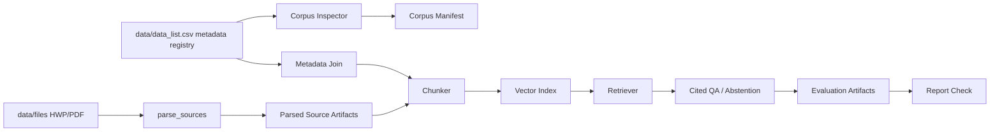

# RFP RAG Baseline 프로젝트 보고서

## 1. 프로젝트 개요

본 프로젝트는 입찰/RFP 문서 100건을 대상으로, 사용자가 자연어로 사업 요약·발주기관·금액·마감일·본문 근거를 질의할 수 있는 **source-first RAG 질의응답 baseline**을 구축하는 것을 목표로 한다.

현재 구현은 원본 HWP/PDF 파싱 artifacts를 RAG 본문 source of truth로 사용한다. `data/data_list.csv`는 사업명, 발주기관, 예산, 마감일, 파일명 등 메타데이터 registry로만 사용하며 CSV `텍스트` 컬럼은 파싱 실패 대체 본문으로 쓰지 않는다.

## 2. 데이터 현황

| 항목 | 값 |
|---|---:|
| CSV row 수 | 100 |
| 비어 있지 않은 텍스트 수 | 100 |
| 정규화 파일 매칭 수 | 100 |
| 원시 파일 직접 매칭 수 | 0 |
| 파일 형식 | HWP 96건, PDF 4건 |

파일명은 macOS 환경의 Unicode 정규화 차이 때문에 raw basename으로는 매칭되지 않았고, NFC/NFD 정규화 resolver를 통해 100건 모두 연결되었다. 실제 RAG 본문은 parsed source artifacts를 기준으로 한다.

## 3. 시스템 구성

핵심 ID 규칙은 다음과 같다.

- 문서 ID: `doc:{csv_row_id}`
- chunk ID: `doc:{csv_row_id}:chunk:{n}`
- `csv_row_id`: 0-based, 3자리 zero padding (`000` ~ `099`)

## 4. 구현 산출물

| 영역 | 파일/모듈 |
|---|---|
| Corpus 로딩/검사 | `rfp_rag/corpus.py`, `rfp_rag/inspect_corpus.py` |
| Chunking | `rfp_rag/chunking.py` |
| Fake retrieval | `rfp_rag/fake_provider.py`, `rfp_rag/index_store.py` |
| Index build | `rfp_rag/build_index.py` |
| 질의응답 | `rfp_rag/ask.py` |
| Evaluation | `rfp_rag/evaluate.py` |
| Report gate | `rfp_rag/report_check.py`, `rfp_rag/contracts.py` |
| Tests | `tests/` |

## 5. 평가 설계

현재 평가는 `fake_offline` provider를 사용한다. 이 provider는 semantic RAG 품질을 주장하기 위한 것이 아니라, 다음 계약을 검증하기 위한 deterministic offline scaffold이다.

- corpus/index schema 정상 여부
- retrieval smoke test
- citation presence / validity
- metadata exact match
- unsupported question abstention
- report artifact completeness

생성된 평가 세트는 다음과 같다.

| 평가 세트 | 개수 | 목적 |
|---|---:|---|
| golden metadata | 40 | 금액·마감일·발주기관·요약 등 CSV 기반 정답 검증 |
| curated text | 10 | 본문 기반 질의 smoke 검증 |
| abstention | 10 | 근거 없는 질문에 `없는 정보` 반환 검증 |
| 총합 | 60 | offline contract 검증 |

## 6. Offline 평가 결과

| 지표 | 결과 |
|---|---:|
| Recall@3 | 0.96 |
| Recall@5 | 0.96 |
| MRR | 0.9267 |
| Citation presence | 1.0 |
| Citation validity | 0.96 |
| Metadata exact match | 0.875 |
| Abstention pass | 0.9 |

중요한 해석 제한:

- `offline_scaffold_complete = true`
- `thresholds_applied = false`
- `rag_quality_complete = false`

즉, 현재 결과는 **구조와 평가 파이프라인이 정상 동작한다는 증거**이지, 실제 LLM 기반 semantic RAG 품질을 증명하는 결과는 아니다.

## 7. 데모 예시

### In-domain 질문

질문: `한영대학교 트랙운영 학사정보시스템 고도화 사업을 요약해줘`

- top source: `doc:000:chunk:0`
- 발주기관: 한영대학
- citation 포함
- warning 없음

### Unsupported 질문

질문: `화성 이주선 산소탱크 발사일은 언제야?`

응답은 `없는 정보`를 포함하고, warning에 `insufficient_context`를 포함한다.

## 8. 한계

1. **API 기반 semantic quality 미검증**
   - `OPENAI_API_KEY`가 없으므로 real embedding/generation 품질 평가는 수행하지 않았다.

2. **Fake lexical retrieval 한계**
   - 현재 retrieval은 deterministic lexical/hash 기반이므로 실제 semantic similarity를 대체하지 않는다.

3. **원문 파싱 품질은 계속 계측 필요**
   - RAG 본문은 parsed source artifacts를 사용한다.
   - CSV는 본문 fallback이 아니라 metadata registry다.
   - 표·이미지·차트 이해는 parser quality lane과 후속 OCR/VLM 평가가 필요하다.

4. **UI 미구현**
   - CLI와 artifacts 중심 baseline이다.

## 9. 다음 단계

우선순위는 다음과 같다.

1. **제출/발표용 자료 정리**
   - 본 보고서와 PPT를 기준으로 프로젝트 흐름을 설명한다.

2. **Real provider 실험**
   - `OPENAI_API_KEY` 확보 시 OpenAI embeddings/generation을 추가한다.
   - 이때 Recall@k, citation validity, abstention, metadata exact match를 real-quality gate로 재평가한다.

3. **검색 개선 실험**
   - BM25
   - hybrid retrieval
   - RRF
   - chunk size / overlap 비교
   - query rewrite

4. **간단 데모 UI**
   - Streamlit 또는 FastAPI 기반 Q&A 화면을 만든다.

5. **원문 파싱 확장**
   - HWP/PDF parser를 붙이고 CSV text와 비교 검증한다.

## 10. 결론

본 프로젝트는 RFP 100건에 대한 RAG baseline의 핵심 골격을 완성했다. 현재 산출물은 API 없이도 재현 가능한 offline scaffold이며, corpus 정합성·index 생성·cited QA·abstention·evaluation/report gate까지 end-to-end로 검증되었다.

다만 real semantic 품질은 아직 주장하지 않는다. API 또는 로컬 semantic model을 붙인 다음 단계에서 `rag_quality_complete`를 목표로 삼는 것이 적절하다.
