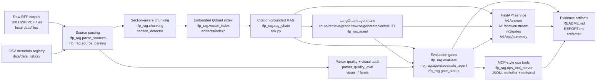
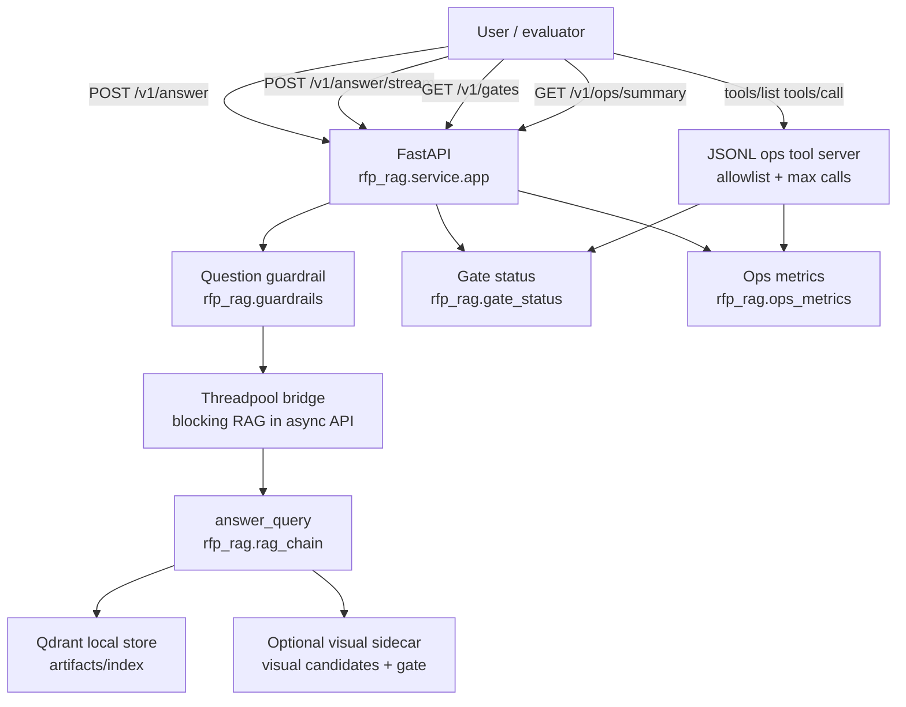
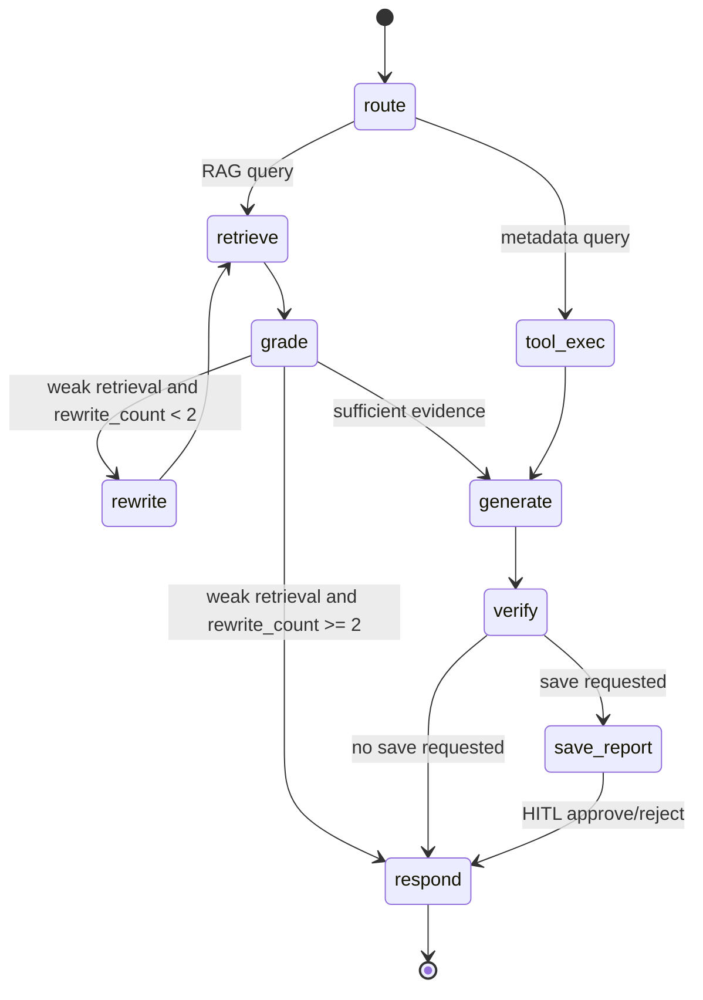
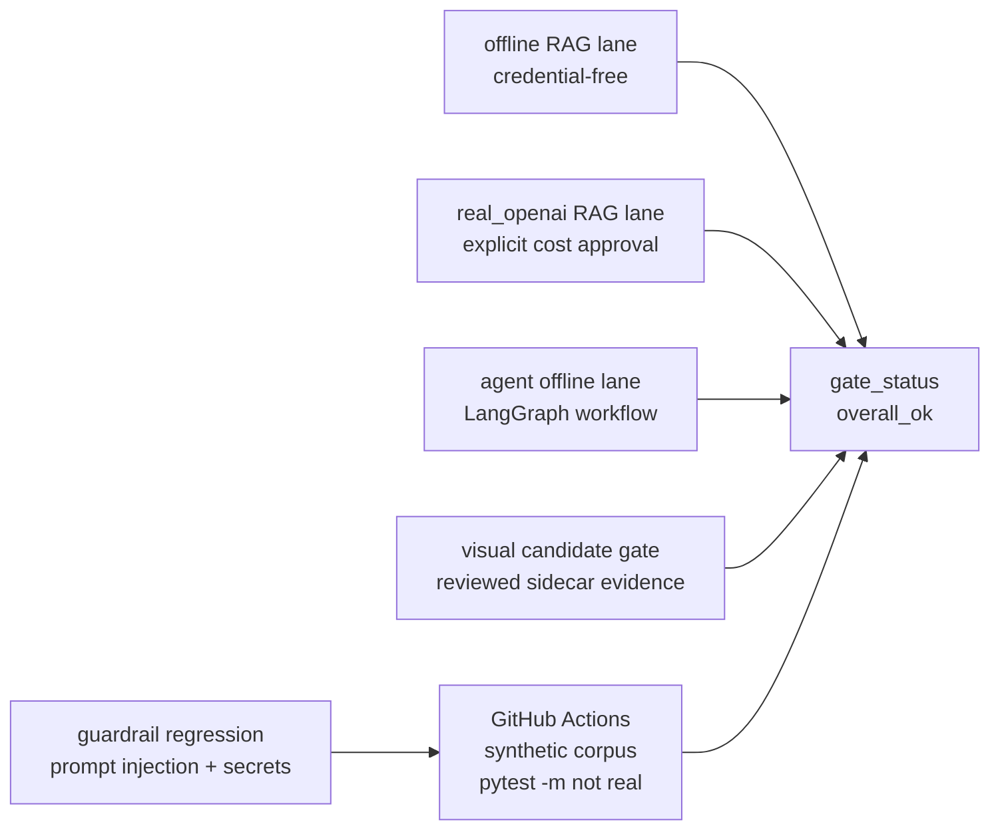

# RFP RAG System Architecture

This document is the architecture evidence map for the current repository. It
only describes implemented, locally verifiable surfaces; planned cloud/UI work is
called out separately in the boundary section.

## Logical Architecture



## Runtime Surfaces



## Agent Workflow



Implemented evidence:

| architecture point | repo evidence | local gate |
|---|---|---|
| typed state | `rfp_rag/agent/state.py` | `tests/test_agent_graph.py` |
| conditional edges | `rfp_rag/agent/graph.py` | `agent_lane_complete` |
| retry/reflection loop | `grade -> rewrite -> retrieve`, max rewrite count | `loop_termination=1.0` |
| checkpointer | `sqlite_checkpointer()` and test `MemorySaver` | CLI resume tests |
| HITL approval | `interrupt()` in `save_report_node` | approve/reject graph tests |
| tool audit | `AuditLogger` JSONL with redacted query-like args | `artifacts/eval_agent/agent_artifacts/audit.jsonl` |

## Evaluation And Evidence Flow



Current local gate files:

| lane | artifact | status evidence |
|---|---|---|
| offline RAG | `artifacts/eval/metrics.json` | `offline_scaffold_complete=true` |
| real RAG | `artifacts/eval_real/metrics.json` | `rag_quality_complete=true` under `rfp-rag-real-v6` with parsed-source lineage and hard-slice floors |
| agent offline | `artifacts/eval_agent/metrics.json` | `agent_lane_complete=true` |
| visual candidate | `artifacts/visual_tesseract_candidate_expanded_gate/summary.json` | `ok=true` |
| guardrails | `artifacts/guardrails/summary.json` | `guardrail_regression_complete=true` |

## Operational Boundaries

- `data/` and `artifacts/` are local evidence and are intentionally gitignored.
- GitHub Actions uses a synthetic corpus; it proves credential-free regression,
  not private corpus publication.
- Docker image excludes raw RFP files and local artifacts; mount them read-only
  for answer/gate endpoints.
- `real_openai` evaluation remains cost-bearing and must be explicitly approved.
- The MCP-style server is read-only JSONL tooling, not full MCP transport/auth.
- Service and ops tool paths are limited to approved repository artifact
  locations; arbitrary local path reads are rejected.
- No public cloud deployment, auth/session/rate-limit layer, live-traffic SLO,
  or broad public dashboard is claimed yet. The service evidence is a
  local/container contract smoke over the RAG and gate surfaces.

## Verification Commands

```bash
uv run pytest -m "not real"
uv run python -m rfp_rag.report_check --eval artifacts/eval --readme README.md
python3 -m rfp_rag.gate_status
python3 -m rfp_rag.guardrail_eval --cases tests/fixtures/guardrail_cases.jsonl --out artifacts/guardrails/summary.json
```
