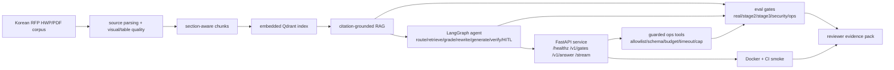

# Senior Reviewer Pack

Date: 2026-06-22

Audience: senior AI Agent Engineer, RAG/LLM application engineer, AI
platform/MLOps interviewer.

## One-line Claim

`rfp-rag` is a source-first Agentic RAG backend for Korean public RFP documents:
it turns hard HWP/PDF procurement files into citation-grounded answers through
measured parsing, retrieval, LangGraph orchestration, guarded tools, service
contracts, local observability, and fail-closed portfolio gates.

Boundary: the Stage 5 claim manifest defines this as production-adjacent
local/container evidence for a senior portfolio. It does not claim public
hosted production, live-traffic SLOs, provider billing telemetry, or unmanaged
paid-provider execution.

## Why This Is Not A Toy RAG Demo

| senior signal | evidence |
| --- | --- |
| Hard source of truth | 100 Korean public RFP HWP/PDF files are parsed into source artifacts; CSV is metadata only. |
| Quality is measured | Real and staged evaluation artifacts track recall, MRR, faithfulness, answer relevancy, citation presence, and citation validity. |
| Retrieval decisions are honest | Vector, BM25, and hybrid retrieval are compared; vector remains default because alternatives have not proven a same-set win. |
| Agent behavior is constrained | LangGraph state, conditional routing, bounded rewrite loops, HITL, checkpoints, and replay artifacts are documented and tested. |
| Tools are bounded | Tool allowlist, schema validation, max calls, timeout, output cap, path safety, and audit summaries are explicit. |
| Operations are visible | FastAPI service, SSE failure contract, Docker runtime smoke, local traces, latency/cost summaries, and failed-run analysis are reviewer-visible. |
| Claims fail closed | `gate_status`, `portfolio_check`, `production_readiness`, CI, and credential-free tests must agree before the portfolio claim is open. |

## 10-minute Review Path

1. Read this file for the claim and boundaries.
2. Open `docs/portfolio/company-fit-matrix.md` to see which role families this
   project targets.
3. Open `docs/architecture/system-architecture.md` for architecture diagrams.
4. Run `./scripts/reviewer-10m.sh`.
5. Inspect `artifacts/portfolio_readiness.json` and
   `artifacts/production_readiness/summary.json`.
6. Open `docs/portfolio/korean-one-page-case-study.md` for the Korean interview
   summary.
7. Inspect `artifacts/final_portfolio_scorecard/summary.json` and
   `docs/portfolio/final-portfolio-scorecard.md` for the weighted final score.
8. Use `docs/portfolio/resume-interview-bullets.md` for resume and interview
   wording.

## Architecture Snapshot

## Scorecard Target

This repository should be treated as Tier A interview-ready only when the
machine scorecard in `artifacts/final_portfolio_scorecard/summary.json`
reports `score_total >= 90` and `failed=[]`.

| dimension | weight | proof path |
| --- | ---: | --- |
| business problem sharpness | 10 | README, this file, Korean one-page case study |
| source-first RAG quality | 20 | `artifacts/eval_real`, `artifacts/eval_stage2_real`, `artifacts/eval_stage3_holdout` |
| agentic engineering depth | 20 | `rfp_rag/agent`, `artifacts/eval_agent_stress`, agent orchestration docs |
| evaluation rigor | 15 | `portfolio_check`, golden/holdout artifacts, failed-run analysis |
| production operations | 15 | Dockerfile, CI, `production_readiness`, service ops, observability |
| guardrails/security | 10 | `security_redteam`, guardrail regression, tool contract matrix |
| hiring presentation | 10 | company-fit matrix, README, demo runbook, resume bullets |

## 3-5 Minute Demo Script

| time | screen | talk track |
| ---: | --- | --- |
| 0:00-0:30 | README Portfolio Status | "This is a source-first Agentic RAG backend for Korean public RFPs. The claim is local/container production evidence, not hosted SaaS." |
| 0:30-1:00 | Architecture diagram | "The hard part is the evidence chain: HWP/PDF parsing, chunking, retrieval, agent workflow, service, tools, and gates." |
| 1:00-1:45 | `./scripts/reviewer-10m.sh` | "The reviewer can regenerate gates and credential-free tests. If artifacts are stale, the claim closes." |
| 1:45-2:30 | RAG/eval artifacts | "Quality is measured by recall, MRR, faithfulness, relevancy, and citation validity, with explicit thresholds and caveats." |
| 2:30-3:15 | Agent/tool artifacts | "LangGraph is used for stateful control: routing, grading, rewrite, verify, HITL, and checkpoint replay." |
| 3:15-4:00 | Ops/security artifacts | "The service has structured errors, SSE failure events, Docker smoke, observability summaries, cost estimates, and guardrail tests." |
| 4:00-4:30 | Company-fit matrix | "The same evidence maps to AI Agent, RAG, platform/MLOps, and FDE-style roles without changing the technical claim." |

## Shot List

- README top: claim, non-claims, verification commands.
- `docs/architecture/system-architecture.md`: logical and runtime diagrams.
- Terminal: `./scripts/reviewer-10m.sh`.
- `artifacts/portfolio_readiness.json`: `portfolio_readiness_check`,
  `interview_readiness_check`, `failed`.
- `artifacts/production_readiness/summary.json`: production-facing checks.
- `artifacts/eval_stage3_holdout/metrics.json`: holdout metrics.
- `artifacts/stage2_quality_scorecard/summary.json`: parser, retrieval,
  citation, context, and visual/table quality scorecard.
- `artifacts/eval_agent_stress/metrics.json`: agent replay and HITL metrics.
- `artifacts/stage3_agent_scorecard/summary.json`: routing/tool accuracy,
  recovery, HITL, checkpoint/thread isolation, planner-executor scenario
  evidence, and audit scorecard.
- `artifacts/stage4_ops_risk_scorecard/summary.json`: trace, failed-run,
  latency/token/cost, service, red-team, dependency, and deployment-boundary
  scorecard.
- `artifacts/fresh_clone_smoke/summary.json`: committed HEAD fresh clone,
  credential-free synthetic corpus, `ruff`, and `pytest -m "not real"` smoke.
- `artifacts/final_portfolio_scorecard/summary.json`: weighted senior
  portfolio score and claim-boundary checks.
- `docs/portfolio/tool-contract-matrix.md`: tool boundary and error contract.
- `docs/portfolio/company-fit-matrix.md`: role-specific pitch.

## Stop Conditions

Do not present the portfolio as final if any of these are true:

- `portfolio_check` or `production_readiness` reports a non-empty `failed` list.
- `./scripts/reviewer-10m.sh` fails.
- README, reviewer pack, company-fit matrix, or resume bullets disagree on the
  main claim in `docs/portfolio/claim-manifest.json`.
- Public hosted production, live traffic, or provider billing telemetry is
  implied without approved evidence.
- Paid/API or cloud work is required but has not been explicitly approved.
